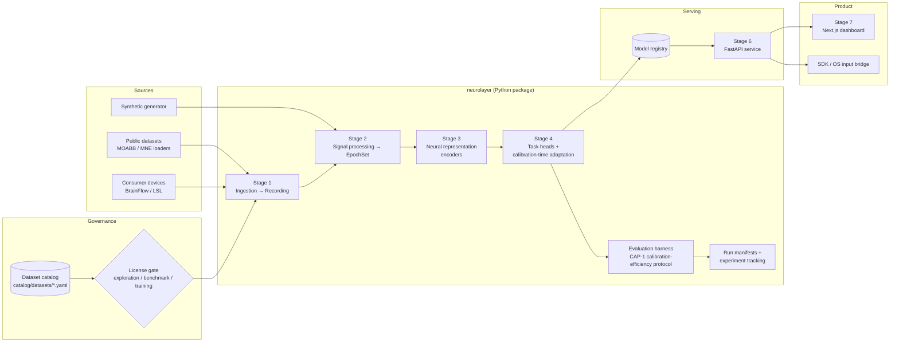

# Architecture overview

## 1. Design goals

1. **Measurable before clever.** The evaluation harness (CAP-1) exists before any model. Every model is a plug-in to it.
2. **Replaceable foundations, proprietary core.** Loaders, filters, general-purpose AI and storage are off-the-shelf and wrapped. The **representation + adaptation** layer is ours.
3. **Modality- and device-agnostic.** Nothing below the task head assumes EEG, a channel count, or a sampling rate. Channels are identified by name, and a montage is data, not code.
4. **Provenance everywhere.** Every number traces back to a git commit, a config hash, dataset card versions, and a license decision.
5. **Privacy by design.** Neural data from people is sensitive (C3). Public datasets and human data flow through the same pipeline but under different controls.
6. **Small, testable stages.** Each stage has a typed contract and can be implemented and tested alone. This is critical when AI coding agents write much of the code.

## 2. System diagram



## 3. Stages and their contracts

| Stage | Module | Input → Output | Contract (stable interface) |
|-------|--------|----------------|-----------------------------|
| 1 Ingestion | `neurolayer.data` | dataset files / device stream → `Recording` | `DatasetAdapter` (WP-1.2); `Recording` validated at construction |
| 2 Signal processing | `neurolayer.signal` | `Recording` → `Recording` (transforms); `Recording` → `EpochSet` (epoching) | Pure, deterministic, versioned transforms; pipeline hash = hash(config + transform versions) |
| 3 Representation | `neurolayer.representation` | `EpochSet` → embeddings | `Encoder` protocol: `fit(source)`, `transform(epochs)` |
| 4 Task models | `neurolayer.models` | `EpochSet` → predictions; `adapt(calibration, unlabeled)` | `Decoder` protocol (defined in `neurolayer.core.interfaces`) |
| Evaluation | `neurolayer.evaluation` | `EpochSet` + decoder factory → `ProtocolResult` | CAP-1 protocol; **protected module** (changes need an ADR) |
| Tracking | `neurolayer.tracking` | config + results → run directory with manifest | `RunManifest` |
| 5/6 API | `neurolayer_api` | HTTP / WebSocket ↔ model registry | OpenAPI schema, versioned under `/v1` |
| 7 Devices | `neurolayer.devices` | device stream (µV) → `Recording`; cue-locked windows → API; intents → sinks | `StreamSource` protocol (BrainFlow, LSL, replay, simulated); `IntentSink`; talks to models only through the API client |
| 7 Product | `apps/web` | API ↔ UI | Consumes the API only; never reads data or models directly |

The core types (`Recording`, `EpochSet`, channel naming and montages) live in `neurolayer.core` and are documented in [data-model.md](data-model.md).

## 4. Layering rules (enforced by `import-linter` in CI)

```
neurolayer_api  ─────────────►  neurolayer (public API only)

cli ─► ┌ experiments ┐ ─► tracking ─► ┌ evaluation ┐ ─► representation ─► signal ─► data ─► core
       └ devices     ┘                 └ models     ┘
```

- Arrows point from a module to the modules it may import. Lower layers **never** import higher layers.
- `devices` and `experiments` are independent siblings. Device code never imports models: it reaches them through the API client, so the same bridge works against a local or remote service.
- `evaluation` and `models` are independent siblings. `evaluation` must not import any concrete model: it depends only on the `Decoder` protocol in `core.interfaces`, which keeps the measuring stick independent of what is measured.
- `core` has no heavy dependencies: only numpy, scipy, scikit-learn, pydantic and pyyaml.
- Heavy or optional dependencies (MNE, MOABB, PyTorch, Braindecode, pyRiemann, MLflow, BrainFlow) are **extras**. They are imported lazily inside the modules that need them, so the core and its tests stay fast.

## 5. Repository map

```
.
├── AGENTS.md                 # Rules for AI coding agents (Codex, Claude Code). Read first.
├── README.md
├── catalog/datasets/         # Dataset cards (YAML): provenance + license. Source of truth for the license gate.
├── configs/experiments/      # Experiment configs (YAML). Every run starts from one.
├── data/                     # Git-ignored. raw/ (immutable, DVC-tracked), interim/ (BIDS), processed/ (by pipeline hash)
├── artifacts/                # Git-ignored. Run outputs: manifests, result tables, model checkpoints.
├── docs/
│   ├── research/             # Landscape, datasets, IP, regulation, gap analysis
│   ├── product/              # Capability specs (CAP-1) and roadmap
│   ├── architecture/         # This document, data model, evaluation protocol, security, reproducibility
│   ├── adr/                  # Architecture Decision Records
│   ├── plan/                 # Work packages with acceptance criteria (hand these to Codex)
│   ├── experiments/          # Experiment card template
│   ├── results/              # Ledger of official results
│   └── guides/               # Dev setup (PC with GPU, Mac), working with AI agents
├── src/
│   ├── neurolayer/           # Proprietary core: core, data, signal, representation, models, evaluation, tracking, experiments, cli
│   └── neurolayer_api/       # FastAPI service
├── apps/web/                 # Next.js + TypeScript dashboard
├── tests/                    # unit/, integration/, api/. Synthetic data only; no downloads.
├── notebooks/                # Exploration only; outputs stripped; reusable code moves to src/
├── docker/                   # Reproducible environments
├── scripts/                  # Repo tooling (e.g. the data-file guard)
└── .github/                  # CI, templates, CODEOWNERS, Dependabot
```

## 6. Where foundation models (LLMs) fit

General-purpose foundation models (Claude, GPT and similar) are **consumers of our decoded outputs and helpers around them**, not part of the neural pipeline:

- explaining results in the dashboard
- agentic behavior triggered by decoded intents
- natural-language control of the platform
- coding assistance

They sit in the product layer (Stage 7) behind a thin provider-agnostic interface, so they stay replaceable. Neural data is **never sent to third-party LLM APIs** (PRIV-9); only decoded, user-approved outputs are.

## 7. Deployment view (target, Stage 6+)

| Environment | Hardware | Runs |
|-------------|----------|------|
| **PC (primary ML)** | Local NVIDIA GPU, WSL2 Ubuntu | Preprocessing, training, evaluation, local inference, MLflow UI |
| **Mac** | Apple Silicon | Web app, API development, product testing; CPU/MPS inference; iOS/macOS later |
| **Cloud GPU (on demand)** | Rented GPU instances | Only for pretraining runs that exceed the local GPU. Same Docker image, same configs. |
| **Hosted services** | Supabase (Postgres, auth, storage), container host for the API | Application data and auth. **No raw C3 neural data** without encryption and a data processing agreement. |

## 8. Related documents

- [Data model](data-model.md)
- [Evaluation protocol](evaluation-protocol.md)
- [Security and privacy](security-and-privacy.md)
- [Reproducibility and experiment tracking](reproducibility.md)
- [ADRs](../adr/)
