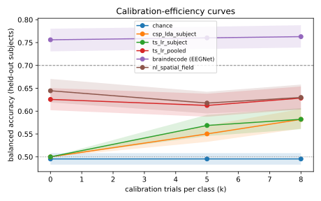

# EXP-20260928-physionet-real-data

- **Status:** R1-Crown, confound check and controls done; R1 (64 channels) running. Predictions were committed before any result of the proprietary model existed (`f620fa7`, 01:24:59 UTC; first model run started 01:52:56). The confound predictions were committed before their runs (`5c7deb4`, `5ffbca0`). Git commit times are the record.
- **Owner:** agent session, for the repository owner
- **Work package / hypothesis:** WP-4.2 (baselines, real data), Stage 5 real-data check / H-real-1, H-real-2
- **Configs:** `configs/experiments/baselines/physionet_b{0..4}_{r1,r1crown}.yaml`, `configs/experiments/physionet/nl_{r1,r1crown}.yaml`
- **Official run ids:** see Results and the [results ledger](../results/README.md#physionet-mi-real-data-109-subjects-budgets-k--058-because-of-22-trials-per-class)

## Question
Does the proprietary spatial-field decoder v0, whose advantage so far exists only on synthetic data, still beat the strongest classical baseline on real EEG from new people? That includes a consumer-headset montage (the Neurosity Crown's 8 sites).

## Why this is not Gate 2
Gate 2 needs the locked holdout (ADR-0009) and the R2/R3 regimes across datasets. Only PhysioNet MI is licensed and reachable from this environment, so this experiment uses one dataset. Its regimes are:
- **R1:** 5-fold cross-subject within PhysioNet, 64 channels.
- **R1-Crown:** the same folds with test subjects restricted to the Crown's 8 sites (CP3, C3, F5, PO3, PO4, F6, C4, CP4). This is a within-dataset montage shift.

PhysioNet's roughly 22 trials per class allow budgets k ∈ {0, 5, 8} with ≥ 10 test trials per class (audit). The gap analysis (§6.5) warns that **gains on R1 alone would suggest dataset or identity artifacts**. This experiment can therefore *refute* the synthetic-data story, but cannot *confirm* the business case on its own.

## Hypotheses and predictions (written before running)
- **H-real-1 (R1-Crown):** `nl_spatial_field` beats the strongest baseline among B1–B4 on R1-Crown. Prediction: mean BA@0 at least **+3 pp** higher, and not worse at k = 5 and 8. Rationale: position-based spatial filters should transfer to a sparse montage better than models fitted on a fixed channel set.
- **H-real-2 (R1):** on the full 64-channel montage the advantage is smaller. Prediction: |ΔBA| ≤ 3 pp at k = 5 and 8. At k = 0 the prediction is positive but under 5 pp.
- **Expected absolute level:** cross-subject left/right imagery on PhysioNet is hard. We expect BA@0 of about 0.55–0.65 for all methods, and a usable-user rate (≥ 70%) below 30% at k = 8.
- **Falsified if:** `nl_spatial_field` is **worse** than the best baseline by more than 3 pp at k = 0 on R1-Crown, or worse at every budget on both regimes. Then the synthetic results do not carry over, and the Stage 5 model needs rework before any Gate 2 attempt.

## Added before the confound runs (committed in `5c7deb4` at 03:20:19 UTC; first confound run started 03:20:35), after seeing B3, B4 and the model on R1-Crown
EEGNet (B4) scored far above every other method on R1-Crown (BA@0 0.756). In PhysioNet the target appears on the **left or right side of the screen**, so the cue is spatially lateralized. A decoder can separate the classes from eye movements (frontal F5/F6) or lateralized visual responses (parieto-occipital PO3/PO4) without decoding imagined hand movement. EEGNet sees the waveform and is the most likely to exploit this.

- **H-confound (prediction, written before running):** if the lateralized cue drives EEGNet, then EEGNet on the Crown's **non-motor** channels alone (F5, F6, PO3, PO4) reaches BA@0 ≥ 0.65, and the motor-only result (C3, C4, CP3, CP4) is > 5 pp below the full-Crown result. If motor imagery drives it, motor-only stays within 5 pp of full-Crown and non-motor stays < 0.58.
- The same split is run for B3.

## Setup
- Data: `physionet_mi`, license ODC-By 1.0, verified by the owner on 2026-09-28; purpose `benchmark`. 109 subjects, fetched from PhysioNet's AWS mirror with SHA-256 verification.
- Preprocessing: default pipeline (unit check, 1–40 Hz band-pass, resample to 128 Hz), window 0.5–2.5 s after the cue.
- Protocol: CAP-1 harness unchanged; chronological calibration, fixed test window, `n_unlabeled` = 10, seed 0, bootstrap CIs over subjects.
- Decoders: B0 chance, B1 CSP+LDA per subject, B2 tangent space + LR per subject, B3 tangent space + LR pooled with re-centering, B4 EEGNet (braindecode), and `nl_spatial_field` v0 with default parameters. No hyperparameter was tuned on PhysioNet.
- All runs are `--official`, from a clean checkout of commit `70c0582`.

## Results

### R1-Crown: new people, Neurosity Crown's 8 sites (109 subjects, all official runs)

| decoder | BA@0 | BA@5 | BA@8 | UUR@8 | AUCEC |
|---|---|---|---|---|---|
| B0 chance | 0.495 | 0.495 | 0.495 | 0.00 | 0.495 |
| B1 CSP+LDA per subject | 0.500 | 0.550 | 0.582 | 0.18 | 0.533 |
| B2 TS+LR per subject | 0.500 | 0.569 | 0.582 | 0.19 | 0.542 |
| B3 TS+LR pooled | 0.626 | 0.612 | 0.629 | 0.27 | 0.619 |
| B4 EEGNet ⚠️ | 0.756 | 0.760 | 0.763 | 0.64 | 0.759 |
| **nl_spatial_field v0** | **0.645** | 0.618 | 0.630 | 0.31 | 0.630 |

Paired against B3 (Wilcoxon over 109 subjects, Holm-corrected): **nl_spatial_field +1.9 pp at k = 0 (p = 0.11), +0.5 pp at k = 5 (p = 1), +0.1 pp at k = 8 (p = 1).** EEGNet +13 to +15 pp (p < 1e-12). Full table and curves: [compare-r1crown.md](../results/physionet/compare-r1crown.md).

### Confound check: which Crown channels carry the signal?

| decoder | full Crown | motor only (C3, C4, CP3, CP4) | non-motor only (F5, F6, PO3, PO4) |
|---|---|---|---|
| B4 EEGNet, BA@0 | 0.756 | 0.677 | **0.719** |
| B3, BA@0 | 0.626 | 0.590 | 0.577 |

**H-confound is supported for EEGNet**, on both pre-registered criteria. Non-motor alone reaches 0.719 (≥ 0.65), and motor-only is 7.9 pp below full-Crown (> 5 pp). EEGNet decodes left vs right better from frontal and parieto-occipital sites than from motor cortex. That is the signature of responses to the lateralized on-screen target (eye movements, visuospatial attention), not of imagined hand movement. B3 draws modest, similar signal from both halves. Even "motor only" is not clean: CP3/CP4 are near parietal areas involved in spatial attention. [compare-confound.md](../results/physionet/compare-confound.md).

### Confound check for the proprietary model (prediction committed in `5ffbca0` at 04:21:53 UTC; runs started 04:22:05)
- **H-confound-nl:** the proprietary model uses band power through position-based spatial filters, as B3 uses covariances. Prediction: it depends on the cue about as little as B3 does. Non-motor-only BA@0 < 0.62, and motor-only BA@0 within 5 pp of its non-motor-only value. If non-motor-only ≥ 0.65, the model's Crown result is cue-driven too.

### R1: new people, 64 channels
*Running.*

## Leakage controls
- **Label-shuffle control (ADR-0010; B3 on R1-Crown, 5 seeds):** BA 0.496 / 0.489 / 0.503 at k = 0 / 5 / 8, all compatible with chance. The harness does not leak labels on real data. The confound above is a property of the dataset's task design, not an evaluation bug.
- **Identity probe (Crown features, 109 subjects):** tangent-space features identify the subject with **100 %** accuracy and log-variance features with 94 % (chance 1.2 %). This confirms the "identity trap" on real data: covariance features carry a strong per-person (and per-recording) fingerprint. It is a privacy concern (PRIV-7) and a reason cross-person decoding is hard. [controls-r1crown.md](../results/physionet/controls-r1crown.md).
- Not yet run: shuffle control and identity probe on the proprietary model's own features (about 80 minutes per seed on this machine).

## Conclusion (interim; R1 64-channel results pending)
- **H-real-1 is not supported.** The proprietary model is +1.9 pp over B3 at k = 0 on the Crown montage, below the predicted +3 pp and not significant (p = 0.11). It is level with B3 at k = 5 and 8. Nor is it falsified: it is never worse than B3. The +10–12 pp advantage seen on synthetic data **does not carry over** to real EEG at that size, as the synthetic-results caveat warned.
- **PhysioNet MI is a confounded benchmark for motor intent.** Its lateralized visual cue lets decoders succeed without decoding imagery; EEGNet exploits this the most. No motor-intent claim, ours or a baseline's, should rest on PhysioNet alone. CAP-1 evaluation needs central-cue datasets (BCI IV 2a/2b, Lee2019, Cho2017), which need network access and license verification.
- **Calibration does not help at k ≤ 8 on this dataset** for any pooled method: BA@5 is not above BA@0. With about 22 trials per class, PhysioNet cannot test the calibration-efficiency part of CAP-1.
- **Product implication:** cues must be central. Our calibration game already shows a central arrow; the pilot protocol should state it and add eye tracking or EOG channels as a control.
