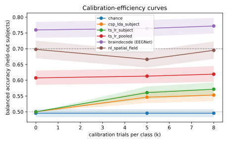

# EXP-20260928-physionet-real-data

- **Status:** done (23 official runs, 109 subjects each). Predictions were committed before any result of the proprietary model existed (`f620fa7`, 01:24:59 UTC; first model run started 01:52:56). The confound predictions were committed before their runs (`5c7deb4`, `5ffbca0`). Git commit times are the record.
- **Owner:** agent session, for the repository owner
- **Work package / hypothesis:** WP-4.2 (baselines, real data), Stage 5 real-data check / H-real-1, H-real-2
- **Configs:** `configs/experiments/baselines/physionet_b{0..4}_{r1,r1crown}.yaml`, `configs/experiments/physionet/nl_{r1,r1crown}.yaml`
- **Official run ids:** see Results and the [results ledger](../results/README.md#physionet-mi-real-data-109-subjects-budgets-k--058-because-of-22-trials-per-class)

## Question
Does the proprietary spatial-field decoder v0, whose advantage so far exists only on synthetic data, still beat the strongest classical baseline on real EEG from new people? That includes a consumer-headset montage (the Neurosity Crown's 8 sites).

## Why this is not Gate 2
Gate 2 needs the locked holdout (ADR-0009) and the R2/R3 regimes across datasets. Only PhysioNet MI is licensed and reachable from this environment, so this experiment uses one dataset. Its regimes are:
- **R1:** 5-fold cross-subject within PhysioNet, 64 channels.
- **R1-Crown:** the same folds with test subjects restricted to the Crown's 8 sites (CP3, C3, F5, PO3, PO4, F6, C4, CP4). This is a within-dataset montage shift.

PhysioNet's roughly 22 trials per class allow budgets k ∈ {0, 5, 8} with ≥ 10 test trials per class (audit). The gap analysis (§6.5) warns that **gains on R1 alone would suggest dataset or identity artifacts**. This experiment can therefore *refute* the synthetic-data story, but cannot *confirm* the business case on its own.

## Hypotheses and predictions (written before running)
- **H-real-1 (R1-Crown):** `nl_spatial_field` beats the strongest baseline among B1–B4 on R1-Crown. Prediction: mean BA@0 at least **+3 pp** higher, and not worse at k = 5 and 8. Rationale: position-based spatial filters should transfer to a sparse montage better than models fitted on a fixed channel set.
- **H-real-2 (R1):** on the full 64-channel montage the advantage is smaller. Prediction: |ΔBA| ≤ 3 pp at k = 5 and 8. At k = 0 the prediction is positive but under 5 pp.
- **Expected absolute level:** cross-subject left/right imagery on PhysioNet is hard. We expect BA@0 of about 0.55–0.65 for all methods, and a usable-user rate (≥ 70%) below 30% at k = 8.
- **Falsified if:** `nl_spatial_field` is **worse** than the best baseline by more than 3 pp at k = 0 on R1-Crown, or worse at every budget on both regimes. Then the synthetic results do not carry over, and the Stage 5 model needs rework before any Gate 2 attempt.

## Added before the confound runs (committed in `5c7deb4` at 03:20:19 UTC; first confound run started 03:20:35), after seeing B3, B4 and the model on R1-Crown
EEGNet (B4) scored far above every other method on R1-Crown (BA@0 0.756). In PhysioNet the target appears on the **left or right side of the screen**, so the cue is spatially lateralized. A decoder can separate the classes from eye movements (frontal F5/F6) or lateralized visual responses (parieto-occipital PO3/PO4) without decoding imagined hand movement. EEGNet sees the waveform and is the most likely to exploit this.

- **H-confound (prediction, written before running):** if the lateralized cue drives EEGNet, then EEGNet on the Crown's **non-motor** channels alone (F5, F6, PO3, PO4) reaches BA@0 ≥ 0.65, and the motor-only result (C3, C4, CP3, CP4) is > 5 pp below the full-Crown result. If motor imagery drives it, motor-only stays within 5 pp of full-Crown and non-motor stays < 0.58.
- The same split is run for B3.

## Setup
- Data: `physionet_mi`, license ODC-By 1.0, verified by the owner on 2026-09-28; purpose `benchmark`. 109 subjects, fetched from PhysioNet's AWS mirror with SHA-256 verification.
- Preprocessing: default pipeline (unit check, 1–40 Hz band-pass, resample to 128 Hz), window 0.5–2.5 s after the cue.
- Protocol: CAP-1 harness unchanged; chronological calibration, fixed test window, `n_unlabeled` = 10, seed 0, bootstrap CIs over subjects.
- Decoders: B0 chance, B1 CSP+LDA per subject, B2 tangent space + LR per subject, B3 tangent space + LR pooled with re-centering, B4 EEGNet (braindecode), and `nl_spatial_field` v0 with default parameters. No hyperparameter was tuned on PhysioNet.
- All runs are `--official`, from clean checkouts. Main runs: `70c0582`. Crown ablations: `5c7deb4` (baselines) and `5ffbca0` (model). Cached B3: `353c9d2`. Full-cap ablations: `f648759`. Each run's manifest records its commit.

## Results

### R1-Crown: new people, Neurosity Crown's 8 sites (109 subjects, all official runs)

| decoder | BA@0 | BA@5 | BA@8 | UUR@8 | AUCEC |
|---|---|---|---|---|---|
| B0 chance | 0.495 | 0.495 | 0.495 | 0.00 | 0.495 |
| B1 CSP+LDA per subject | 0.500 | 0.550 | 0.582 | 0.18 | 0.533 |
| B2 TS+LR per subject | 0.500 | 0.569 | 0.582 | 0.19 | 0.542 |
| B3 TS+LR pooled | 0.626 | 0.612 | 0.629 | 0.27 | 0.619 |
| B4 EEGNet ⚠️ | 0.756 | 0.760 | 0.763 | 0.64 | 0.759 |
| **nl_spatial_field v0** | **0.645** | 0.618 | 0.630 | 0.31 | 0.630 |

Paired against B3 (Wilcoxon over 109 subjects, Holm-corrected): **nl_spatial_field +1.9 pp at k = 0 (p = 0.11), +0.5 pp at k = 5 (p = 1), +0.1 pp at k = 8 (p = 1).** EEGNet +13 to +15 pp (p < 1e-12). Full table and curves: [compare-r1crown.md](../results/physionet/compare-r1crown.md).

### Confound check: which Crown channels carry the signal?

| decoder | full Crown | motor only (C3, C4, CP3, CP4) | non-motor only (F5, F6, PO3, PO4) |
|---|---|---|---|
| B4 EEGNet, BA@0 | 0.756 | 0.677 | **0.719** |
| B3, BA@0 | 0.626 | 0.590 | 0.577 |

**H-confound is supported for EEGNet**, on both pre-registered criteria. Non-motor alone reaches 0.719 (≥ 0.65), and motor-only is 7.9 pp below full-Crown (> 5 pp). EEGNet decodes left vs right better from frontal and parieto-occipital sites than from motor cortex. That is the signature of responses to the lateralized on-screen target (eye movements, visuospatial attention), not of imagined hand movement. B3 draws modest, similar signal from both halves. Even "motor only" is not clean: CP3/CP4 are near parietal areas involved in spatial attention. [compare-confound.md](../results/physionet/compare-confound.md).

### Confound check for the proprietary model (prediction committed in `5ffbca0` at 04:21:53 UTC; runs started 04:22:05)
- **H-confound-nl:** the proprietary model uses band power through position-based spatial filters, as B3 uses covariances. Prediction: it depends on the cue about as little as B3 does. Non-motor-only BA@0 < 0.62, and motor-only BA@0 within 5 pp of its non-motor-only value. If non-motor-only ≥ 0.65, the model's Crown result is cue-driven too.
- **Result: supported.** Non-motor only BA@0 = 0.587 (< 0.62); motor only = 0.590 (within 0.3 pp). Like B3, the model draws similar, modest signal from both halves (full Crown 0.645). It does not rely on the cue the way EEGNet does.

| BA@0 | full Crown | motor only | non-motor only |
|---|---|---|---|
| B4 EEGNet | 0.756 | 0.677 | **0.719** |
| B3 | 0.626 | 0.590 | 0.577 |
| nl_spatial_field | 0.645 | 0.590 | 0.587 |

### Confound check on the full cap (prediction committed in `f648759` at 05:05:28 UTC; runs started 05:05:31)
On 64 channels the proprietary model beat B3 by +9.1 pp at k = 0 (p = 2e-10). That is the opposite of H-real-2, which predicted a smaller gap. A full cap includes frontal and occipital sites where the lateralized cue shows up, so the gain could be cue-driven.
- **H-confound-64 (prediction):** if the gain is motor-driven, the model restricted to the 21-channel sensorimotor strip (FC/C/CP rows) keeps ≥ +5 pp over B3 on the same channels at k = 0. If it is cue-driven, the model on the other 43 channels alone reaches BA@0 ≥ 0.65 and beats its own motor-strip result.
- **Result: neither branch holds cleanly.**

| BA@0 | 64 ch | motor strip (21) | non-motor (43) |
|---|---|---|---|
| B3 | 0.607 | 0.632 | 0.589 |
| nl_spatial_field | **0.698** | **0.664** | 0.634 |

On the motor strip the model beats B3 by **+3.1 pp at k = 0 (Holm p = 0.020), +2.5 pp at k = 5 (p = 0.036) and +3.6 pp at k = 8 (p = 0.020)**. That is significant, but below the +5 pp the "motor-driven" branch required. On the 43 non-motor channels the model reaches 0.634 (< 0.65) and stays below its motor-strip result, so the "cue-driven" branch fails too. The +9.1 pp full-cap gain decomposes roughly as follows:
- **B3 degrades with many channels** (0.632 on the motor strip → 0.607 on 64 channels; 2,080 tangent-space features). The model does not (0.664 → 0.698).
- **A modest, significant advantage on the sensorimotor strip** (about +3 pp).
- **Extra gain from combining non-motor channels.** It cannot be attributed on PhysioNet: it may be cue-related, or genuine distributed signal.

[compare-confound64.md](../results/physionet/compare-confound64.md)

### R1: new people, 64 channels (109 subjects, official runs)

| decoder | BA@0 | BA@5 | BA@8 | UUR@8 | AUCEC |
|---|---|---|---|---|---|
| B0 chance | 0.495 | 0.495 | 0.495 | 0.00 | 0.495 |
| B1 CSP+LDA per subject | 0.500 | 0.546 | 0.553 | 0.10 | 0.528 |
| B2 TS+LR per subject | 0.500 | 0.561 | 0.572 | 0.15 | 0.537 |
| B3 TS+LR pooled | 0.607 | 0.613 | 0.619 | 0.26 | 0.611 |
| B4 EEGNet ⚠️ | 0.760 | 0.764 | 0.772 | 0.67 | 0.763 |
| **nl_spatial_field v0** | **0.698** | 0.666 | 0.695 | 0.48 | 0.682 |

Paired against B3: **nl_spatial_field +9.1 pp at k = 0 (p = 2e-10), +5.3 pp at k = 5 (p = 3e-5), +7.6 pp at k = 8 (p = 4e-8).** **H-real-2 is falsified in the favourable direction**: it predicted a smaller gap than on the Crown. The full-cap ablation above shows that only about 3 pp of this gain is confound-controlled. [compare-r1.md](../results/physionet/compare-r1.md)

**B3 implementation note.** The first 64-channel B3 run (old code) was stopped after 1 of 5 folds (3.3 h). Profiling showed that 90 % of its time went to recomputing identical source statistics, so B3 now caches them (`353c9d2`). The cached B3 reproduced the original R1-Crown run exactly (all 327 per-subject scores identical) before the 64-channel run was made with it.

## Leakage controls
- **Label-shuffle control (ADR-0010; B3 on R1-Crown, 5 seeds):** BA 0.496 / 0.489 / 0.503 at k = 0 / 5 / 8, all compatible with chance. The harness does not leak labels on real data. The confound above is a property of the dataset's task design, not an evaluation bug.
- **Identity probe (Crown features, 109 subjects):** tangent-space features identify the subject with **100 %** accuracy and log-variance features with 94 % (chance 1.2 %). This confirms the "identity trap" on real data: covariance features carry a strong per-person (and per-recording) fingerprint. It is a privacy concern (PRIV-7) and a reason cross-person decoding is hard. [controls-r1crown.md](../results/physionet/controls-r1crown.md).
- Not yet run: shuffle control and identity probe on the proprietary model's own features. They are required before any claim about the model; about 13 minutes per seed on 64 channels on this machine.

## Conclusion
1. **The synthetic-data advantage does not transfer at its synthetic size, and the model is not beaten.** On the Crown montage the model is +1.9 pp over B3 at k = 0 (p = 0.11), so H-real-1 is not supported. On the 21-channel sensorimotor strip it is **+2.5 to +3.6 pp over B3, significant at every budget** (p ≤ 0.036). That is the first confound-controlled, statistically significant advantage on real EEG. It is modest, on one dataset, and not a Gate 2 result.
2. **The model scales to many channels better than the classical baseline** (+9 pp on 64 channels). Part of that comes from B3 degrading with 2,080 features, and part from non-motor channels whose contribution cannot be separated from the cue on this dataset.
3. **PhysioNet MI is confounded for motor intent.** Its target appears on the left or right of the screen. EEGNet reaches 0.72 BA from forehead and parieto-occipital sites alone, above what it gets from motor cortex. No motor-intent claim, ours or anyone's, should rest on PhysioNet. This also applies to published cross-subject results on it.
4. **Calibration does not help at k ≤ 8 here** for any pooled method. With about 22 trials per class, PhysioNet cannot test the calibration-efficiency half of CAP-1.
5. **Identity leaks strongly** (100 % subject identification from covariance features). This is a privacy risk (PRIV-7) and a modelling target (below).

## Next (proposal for v1; owner to prioritize)
1. **Evaluate only on central-cue data.** BCI IV 2a/2b (BNCI), Lee2019 and Cho2017 use a central arrow. They need their hosts allowed and licenses verified ([owner actions](../plan/owner-actions.md)). Keep PhysioNet for pretraining only, and **always report the motor-strip ablation** next to any full-cap number.
2. **Controls on the model's own features:** the multi-seed shuffle control (ADR-0010) and the identity probe, before any claim.
3. **Model v1 work, in order of evidence:**
   - Train with the non-motor channels masked or down-weighted, so the model cannot learn the cue; confirm with the ablation.
   - Add an identity-adversarial or subject-invariance term. H4 showed lower identity decodability on synthetic data; measure it on real data.
   - Make calibration help: the head fine-tuning slightly *hurts* at k = 5 (0.666 vs 0.698 at k = 0 on 64 channels). Try Bayesian/shrinkage heads, or alignment-only adaptation for small k.
   - Tune hyperparameters on source subjects only (nested folds). Everything here used defaults chosen on synthetic data.
4. **Product and pilot:** keep central cues. Add EOG channels or eye tracking to the pilot protocol, so our own data can separate eye movements from imagery.
