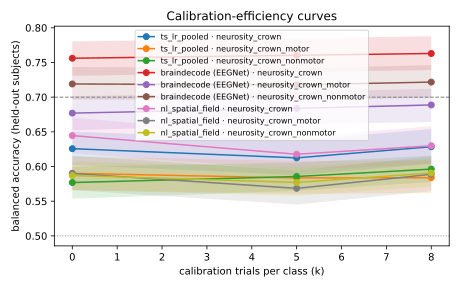

# Run comparison

| run | decoder | BA@0 | BA@5 | BA@8 | UUR@max | AUCEC | median TTC |
|---|---|---|---|---|---|---|---|
| `20260928T015255Z-physionet-b3-r1crown-5bc0b8` | ts_lr_pooled | 0.626 [0.60, 0.65] | 0.612 [0.59, 0.64] | 0.629 [0.60, 0.65] | 0.27 | 0.619 | never |
| `20260928T033852Z-physionet-confound-b3-motor-5d54a5` | ts_lr_pooled | 0.590 [0.57, 0.61] | 0.584 [0.56, 0.61] | 0.584 [0.56, 0.61] | 0.16 | 0.586 | never |
| `20260928T033615Z-physionet-confound-b3-nonmotor-071995` | ts_lr_pooled | 0.577 [0.55, 0.60] | 0.586 [0.57, 0.61] | 0.596 [0.58, 0.62] | 0.19 | 0.583 | never |
| `20260928T031833Z-physionet-b4-r1crown-179f8a` | braindecode (EEGNet) | 0.756 [0.73, 0.78] | 0.760 [0.74, 0.78] | 0.763 [0.74, 0.79] | 0.64 | 0.759 | 0 |
| `20260928T033322Z-physionet-confound-b4-motor-2f386f` | braindecode (EEGNet) | 0.677 [0.65, 0.70] | 0.684 [0.66, 0.71] | 0.689 [0.66, 0.71] | 0.50 | 0.682 | 5 |
| `20260928T032637Z-physionet-confound-b4-nonmotor-ab72a4` | braindecode (EEGNet) | 0.719 [0.70, 0.74] | 0.718 [0.70, 0.74] | 0.722 [0.70, 0.75] | 0.59 | 0.719 | 0 |

