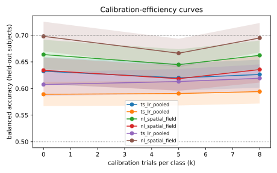

# Run comparison

| run | decoder | BA@0 | BA@5 | BA@8 | UUR@max | AUCEC | median TTC |
|---|---|---|---|---|---|---|---|
| `20260928T050700Z-physionet-confound64-b3-motor-67ec73` | ts_lr_pooled · motor_strip_21 | 0.632 [0.61, 0.66] | 0.620 [0.60, 0.65] | 0.626 [0.60, 0.65] | 0.29 | 0.626 | never |
| `20260928T051141Z-physionet-confound64-b3-nonmotor-b9d130` | ts_lr_pooled · non_motor_43 | 0.589 [0.57, 0.61] | 0.591 [0.57, 0.61] | 0.594 [0.57, 0.62] | 0.20 | 0.590 | never |
| `20260928T052326Z-physionet-confound64-nl-motor-bdc55d` | nl_spatial_field · motor_strip_21 | 0.664 [0.64, 0.69] | 0.645 [0.62, 0.67] | 0.662 [0.64, 0.69] | 0.39 | 0.654 | never |
| `20260928T053536Z-physionet-confound64-nl-nonmotor-be0ea1` | nl_spatial_field · non_motor_43 | 0.634 [0.61, 0.66] | 0.618 [0.60, 0.64] | 0.636 [0.61, 0.66] | 0.32 | 0.626 | never |
| `20260928T050420Z-physionet-b3-r1-41b7a1` | ts_lr_pooled | 0.607 [0.59, 0.63] | 0.613 [0.59, 0.64] | 0.619 [0.60, 0.65] | 0.26 | 0.611 | never |
| `20260928T040417Z-physionet-nl-r1-b80175` | nl_spatial_field | 0.698 [0.67, 0.73] | 0.666 [0.64, 0.69] | 0.695 [0.67, 0.72] | 0.48 | 0.682 | 0 |

## Paired vs reference: ts_lr_pooled · motor_strip_21 (`20260928T050700Z-physionet-confound64-b3-motor-67ec73`)

| decoder | k | mean ΔBA | Holm p | n subjects |
|---|---|---|---|---|
| ts_lr_pooled · non_motor_43 | 0 | -0.043 | 0.00171 | 109 |
| ts_lr_pooled · non_motor_43 | 5 | -0.029 | 0.0281 | 109 |
| ts_lr_pooled · non_motor_43 | 8 | -0.032 | 0.0274 | 109 |
| nl_spatial_field · motor_strip_21 | 0 | +0.031 | 0.0201 | 109 |
| nl_spatial_field · motor_strip_21 | 5 | +0.025 | 0.0362 | 109 |
| nl_spatial_field · motor_strip_21 | 8 | +0.036 | 0.0201 | 109 |
| nl_spatial_field · non_motor_43 | 0 | +0.002 | 1 | 109 |
| nl_spatial_field · non_motor_43 | 5 | -0.002 | 1 | 109 |
| nl_spatial_field · non_motor_43 | 8 | +0.009 | 0.933 | 109 |
| ts_lr_pooled | 0 | -0.025 | 0.0444 | 109 |
| ts_lr_pooled | 5 | -0.007 | 0.623 | 109 |
| ts_lr_pooled | 8 | -0.007 | 0.623 | 109 |
| nl_spatial_field | 0 | +0.066 | 3.59e-08 | 109 |
| nl_spatial_field | 5 | +0.046 | 0.000319 | 109 |
| nl_spatial_field | 8 | +0.069 | 9.49e-07 | 109 |

