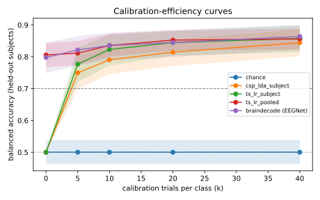

# Run comparison

> Contains exploratory (non-official) runs: not citable as results.

| run | decoder | BA@0 | BA@5 | BA@10 | BA@20 | BA@40 | UUR@max | AUCEC | median TTC |
|---|---|---|---|---|---|---|---|---|---|
| `20260926T065411Z-synthetic-b0-r2-f9795d` | chance | 0.500 [0.46, 0.54] | 0.500 [0.46, 0.54] | 0.500 [0.46, 0.54] | 0.500 [0.46, 0.54] | 0.500 [0.46, 0.54] | 0.00 | 0.500 | never |
| `20260926T065419Z-synthetic-b1-r2-2882a9` | csp_lda_subject | 0.500 [0.50, 0.50] | 0.750 [0.70, 0.80] | 0.790 [0.75, 0.83] | 0.815 [0.77, 0.85] | 0.844 [0.80, 0.89] | 1.00 | 0.716 | 5 |
| `20260926T065427Z-synthetic-b2-r2-73adae` | ts_lr_subject | 0.500 [0.50, 0.50] | 0.777 [0.72, 0.83] | 0.823 [0.77, 0.87] | 0.844 [0.80, 0.88] | 0.858 [0.82, 0.90] | 0.94 | 0.737 | 5 |
| `20260926T065452Z-synthetic-b3-r2-dded6e` | ts_lr_pooled | 0.806 [0.77, 0.84] | 0.811 [0.77, 0.85] | 0.835 [0.80, 0.87] | 0.852 [0.82, 0.88] | 0.856 [0.82, 0.89] | 1.00 | 0.825 | 0 |
| `20260926T065533Z-synthetic-b4-r2-f8f8d8` | braindecode (EEGNet) | 0.798 [0.75, 0.84] | 0.821 [0.77, 0.86] | 0.835 [0.79, 0.88] | 0.845 [0.80, 0.88] | 0.864 [0.82, 0.90] | 0.94 | 0.826 | 0 |

## Paired vs reference: ts_lr_pooled (`20260926T065452Z-synthetic-b3-r2-dded6e`)

| decoder | k | mean ΔBA | Holm p | n subjects |
|---|---|---|---|---|
| chance | 0 | -0.305 | 0.000153 | 16 |
| chance | 5 | -0.311 | 0.000153 | 16 |
| chance | 10 | -0.335 | 0.000153 | 16 |
| chance | 20 | -0.352 | 0.000153 | 16 |
| chance | 40 | -0.356 | 0.000153 | 16 |
| csp_lda_subject | 0 | -0.306 | 0.000153 | 16 |
| csp_lda_subject | 5 | -0.062 | 0.0304 | 16 |
| csp_lda_subject | 10 | -0.045 | 0.0607 | 16 |
| csp_lda_subject | 20 | -0.038 | 0.0304 | 16 |
| csp_lda_subject | 40 | -0.012 | 0.306 | 16 |
| ts_lr_subject | 0 | -0.306 | 0.000153 | 16 |
| ts_lr_subject | 5 | -0.034 | 0.351 | 16 |
| ts_lr_subject | 10 | -0.013 | 0.867 | 16 |
| ts_lr_subject | 20 | -0.008 | 0.867 | 16 |
| ts_lr_subject | 40 | +0.002 | 0.975 | 16 |
| braindecode (EEGNet) | 0 | -0.008 | 1 | 16 |
| braindecode (EEGNet) | 5 | +0.010 | 1 | 16 |
| braindecode (EEGNet) | 10 | -0.000 | 1 | 16 |
| braindecode (EEGNet) | 20 | -0.008 | 1 | 16 |
| braindecode (EEGNet) | 40 | +0.008 | 1 | 16 |

