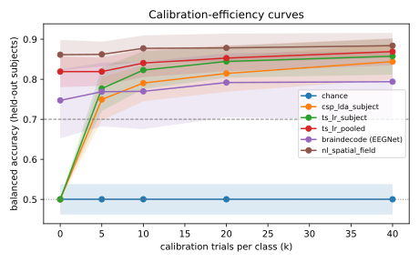

# Run comparison

> Contains exploratory (non-official) runs: not citable as results.

| run | decoder | BA@0 | BA@5 | BA@10 | BA@20 | BA@40 | UUR@max | AUCEC | median TTC |
|---|---|---|---|---|---|---|---|---|---|
| `20260926T065210Z-synthetic-b0-r1-07ef86` | chance | 0.500 [0.46, 0.54] | 0.500 [0.46, 0.54] | 0.500 [0.46, 0.54] | 0.500 [0.46, 0.54] | 0.500 [0.46, 0.54] | 0.00 | 0.500 | never |
| `20260926T065218Z-synthetic-b1-r1-8fbd6e` | csp_lda_subject | 0.500 [0.50, 0.50] | 0.750 [0.70, 0.81] | 0.790 [0.74, 0.83] | 0.815 [0.77, 0.86] | 0.844 [0.80, 0.89] | 1.00 | 0.716 | 5 |
| `20260926T065227Z-synthetic-b2-r1-6995fb` | ts_lr_subject | 0.500 [0.50, 0.50] | 0.777 [0.72, 0.83] | 0.823 [0.78, 0.87] | 0.844 [0.80, 0.88] | 0.858 [0.81, 0.90] | 0.94 | 0.737 | 5 |
| `20260926T065303Z-synthetic-b3-r1-23e4f1` | ts_lr_pooled | 0.819 [0.78, 0.86] | 0.819 [0.78, 0.85] | 0.840 [0.81, 0.87] | 0.853 [0.82, 0.88] | 0.869 [0.83, 0.90] | 1.00 | 0.833 | 0 |
| `20260926T065408Z-synthetic-b4-r1-bdd40a` | braindecode (EEGNet) | 0.747 [0.65, 0.82] | 0.769 [0.68, 0.84] | 0.770 [0.68, 0.84] | 0.792 [0.70, 0.86] | 0.794 [0.70, 0.87] | 0.81 | 0.770 | 0 |
| `20260926T071630Z-stage5-nl-r1-d7c0f0` | nl_spatial_field | 0.861 [0.82, 0.90] | 0.862 [0.83, 0.89] | 0.877 [0.84, 0.91] | 0.878 [0.84, 0.91] | 0.884 [0.85, 0.92] | 1.00 | 0.869 | 0 |

## Paired vs reference: ts_lr_pooled (`20260926T065303Z-synthetic-b3-r1-23e4f1`)

| decoder | k | mean ΔBA | Holm p | n subjects |
|---|---|---|---|---|
| chance | 0 | -0.319 | 0.000153 | 16 |
| chance | 5 | -0.319 | 0.000153 | 16 |
| chance | 10 | -0.340 | 0.000153 | 16 |
| chance | 20 | -0.353 | 0.000153 | 16 |
| chance | 40 | -0.369 | 0.000153 | 16 |
| csp_lda_subject | 0 | -0.319 | 0.000153 | 16 |
| csp_lda_subject | 5 | -0.070 | 0.0167 | 16 |
| csp_lda_subject | 10 | -0.050 | 0.0198 | 16 |
| csp_lda_subject | 20 | -0.038 | 0.0198 | 16 |
| csp_lda_subject | 40 | -0.025 | 0.0654 | 16 |
| ts_lr_subject | 0 | -0.319 | 0.000153 | 16 |
| ts_lr_subject | 5 | -0.042 | 0.121 | 16 |
| ts_lr_subject | 10 | -0.018 | 0.628 | 16 |
| ts_lr_subject | 20 | -0.008 | 0.628 | 16 |
| ts_lr_subject | 40 | -0.011 | 0.628 | 16 |
| braindecode (EEGNet) | 0 | -0.072 | 1 | 16 |
| braindecode (EEGNet) | 5 | -0.050 | 1 | 16 |
| braindecode (EEGNet) | 10 | -0.071 | 0.932 | 16 |
| braindecode (EEGNet) | 20 | -0.061 | 1 | 16 |
| braindecode (EEGNet) | 40 | -0.075 | 0.789 | 16 |
| nl_spatial_field | 0 | +0.042 | 0.177 | 16 |
| nl_spatial_field | 5 | +0.043 | 0.0189 | 16 |
| nl_spatial_field | 10 | +0.037 | 0.0473 | 16 |
| nl_spatial_field | 20 | +0.025 | 0.295 | 16 |
| nl_spatial_field | 40 | +0.015 | 0.295 | 16 |

