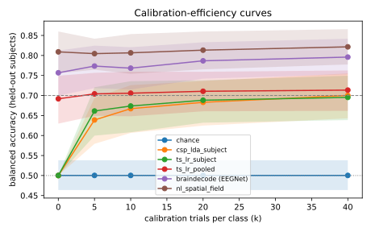

# Run comparison

> Contains exploratory (non-official) runs: not citable as results.

| run | decoder | BA@0 | BA@5 | BA@10 | BA@20 | BA@40 | UUR@max | AUCEC | median TTC |
|---|---|---|---|---|---|---|---|---|---|
| `20260926T065536Z-synthetic-b0-r3-d8d6d1` | chance | 0.500 [0.46, 0.54] | 0.500 [0.46, 0.54] | 0.500 [0.46, 0.54] | 0.500 [0.46, 0.54] | 0.500 [0.46, 0.54] | 0.00 | 0.500 | never |
| `20260926T065543Z-synthetic-b1-r3-d00313` | csp_lda_subject | 0.500 [0.50, 0.50] | 0.639 [0.58, 0.69] | 0.667 [0.61, 0.73] | 0.683 [0.62, 0.74] | 0.700 [0.64, 0.76] | 0.62 | 0.623 | 10 |
| `20260926T065551Z-synthetic-b2-r3-783c2b` | ts_lr_subject | 0.500 [0.50, 0.50] | 0.661 [0.60, 0.72] | 0.674 [0.61, 0.74] | 0.688 [0.63, 0.74] | 0.695 [0.64, 0.75] | 0.56 | 0.632 | 10 |
| `20260926T065604Z-synthetic-b3-r3-eeb588` | ts_lr_pooled | 0.692 [0.63, 0.75] | 0.704 [0.65, 0.76] | 0.706 [0.65, 0.76] | 0.711 [0.66, 0.76] | 0.713 [0.66, 0.76] | 0.56 | 0.703 | 0 |
| `20260926T065632Z-synthetic-b4-r3-530d27` | braindecode (EEGNet) | 0.757 [0.70, 0.81] | 0.774 [0.72, 0.82] | 0.768 [0.71, 0.82] | 0.787 [0.74, 0.83] | 0.796 [0.75, 0.84] | 0.88 | 0.773 | 0 |
| `20260926T071701Z-stage5-nl-r3-b88e30` | nl_spatial_field | 0.809 [0.76, 0.86] | 0.805 [0.76, 0.84] | 0.807 [0.75, 0.85] | 0.813 [0.77, 0.86] | 0.822 [0.78, 0.87] | 0.94 | 0.809 | 0 |

## Paired vs reference: ts_lr_pooled (`20260926T065604Z-synthetic-b3-r3-eeb588`)

| decoder | k | mean ΔBA | Holm p | n subjects |
|---|---|---|---|---|
| chance | 0 | -0.192 | 0.000305 | 16 |
| chance | 5 | -0.204 | 0.000153 | 16 |
| chance | 10 | -0.205 | 0.000153 | 16 |
| chance | 20 | -0.210 | 0.000153 | 16 |
| chance | 40 | -0.213 | 0.000153 | 16 |
| csp_lda_subject | 0 | -0.192 | 0.000458 | 16 |
| csp_lda_subject | 5 | -0.065 | 0.00393 | 16 |
| csp_lda_subject | 10 | -0.039 | 0.0784 | 16 |
| csp_lda_subject | 20 | -0.028 | 0.187 | 16 |
| csp_lda_subject | 40 | -0.013 | 0.507 | 16 |
| ts_lr_subject | 0 | -0.192 | 0.000458 | 16 |
| ts_lr_subject | 5 | -0.043 | 0.0798 | 16 |
| ts_lr_subject | 10 | -0.032 | 0.183 | 16 |
| ts_lr_subject | 20 | -0.022 | 0.267 | 16 |
| ts_lr_subject | 40 | -0.018 | 0.267 | 16 |
| braindecode (EEGNet) | 0 | +0.065 | 0.0886 | 16 |
| braindecode (EEGNet) | 5 | +0.070 | 0.0886 | 16 |
| braindecode (EEGNet) | 10 | +0.063 | 0.087 | 16 |
| braindecode (EEGNet) | 20 | +0.076 | 0.0549 | 16 |
| braindecode (EEGNet) | 40 | +0.083 | 0.0795 | 16 |
| nl_spatial_field | 0 | +0.117 | 0.00314 | 16 |
| nl_spatial_field | 5 | +0.101 | 0.000458 | 16 |
| nl_spatial_field | 10 | +0.101 | 0.000153 | 16 |
| nl_spatial_field | 20 | +0.103 | 0.000244 | 16 |
| nl_spatial_field | 40 | +0.108 | 0.00061 | 16 |

